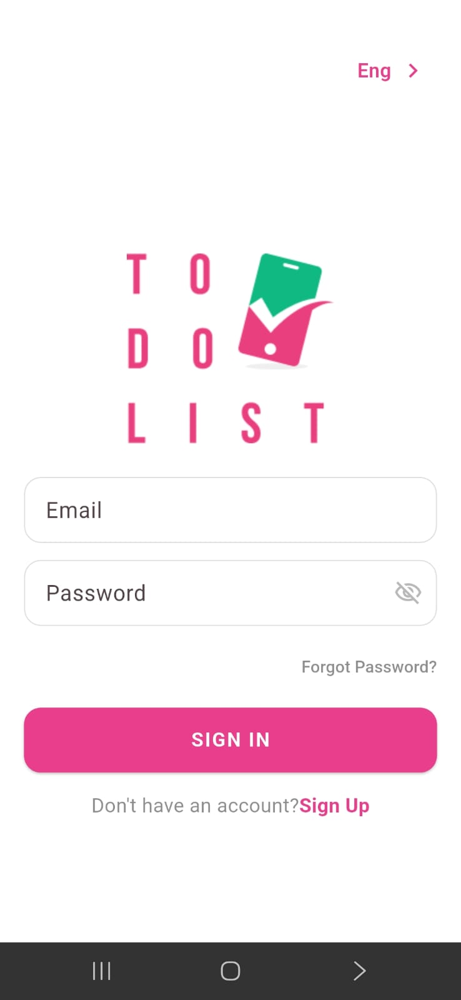
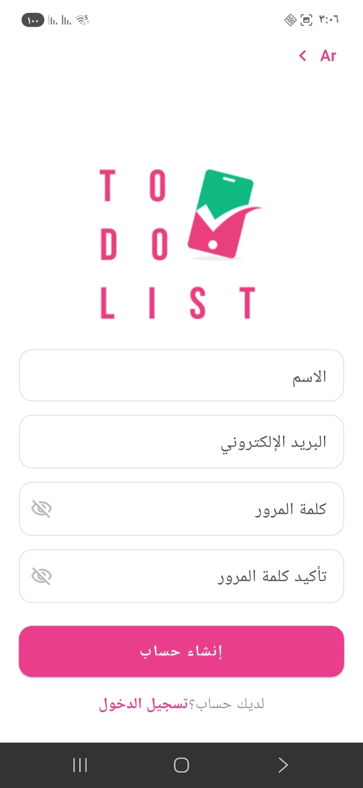
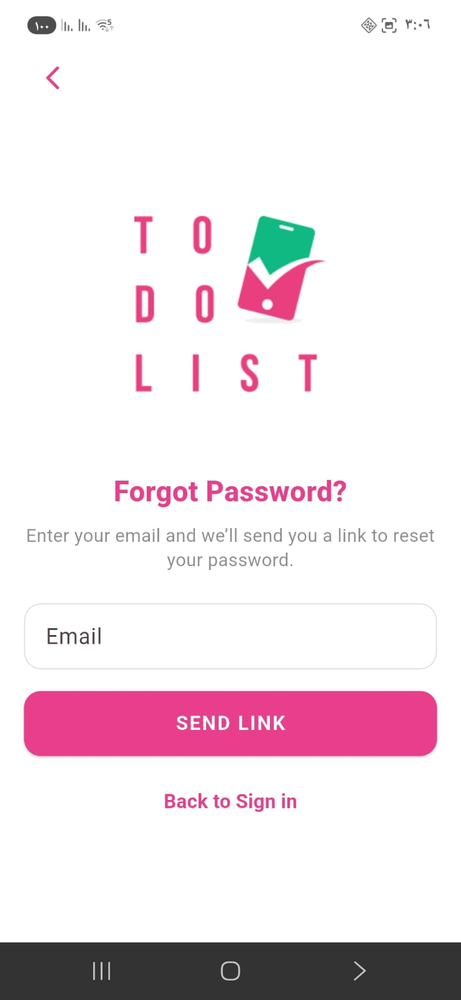
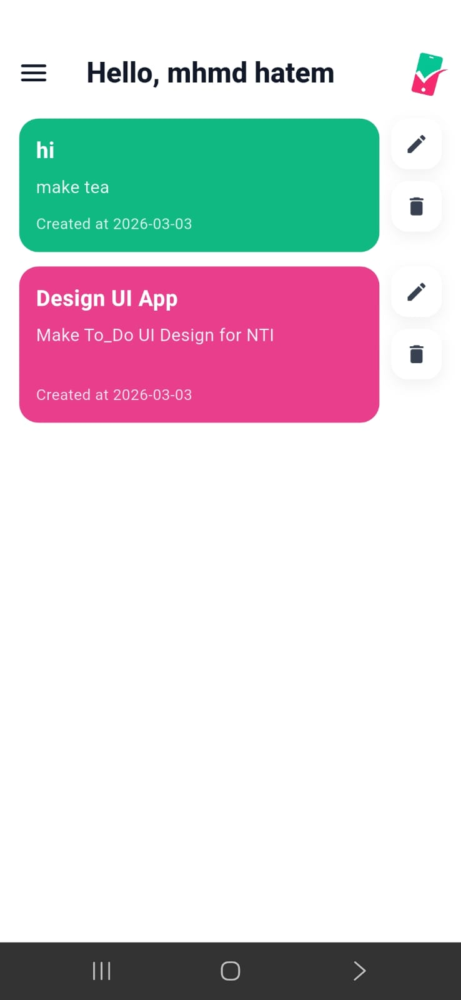
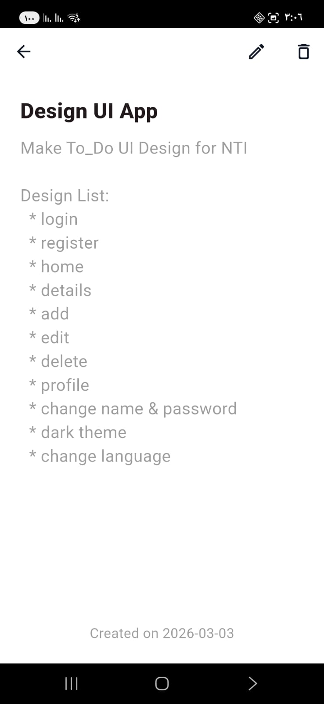
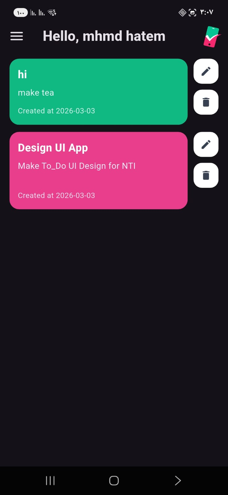
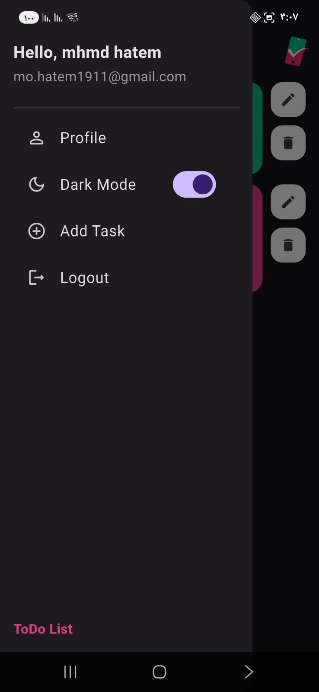
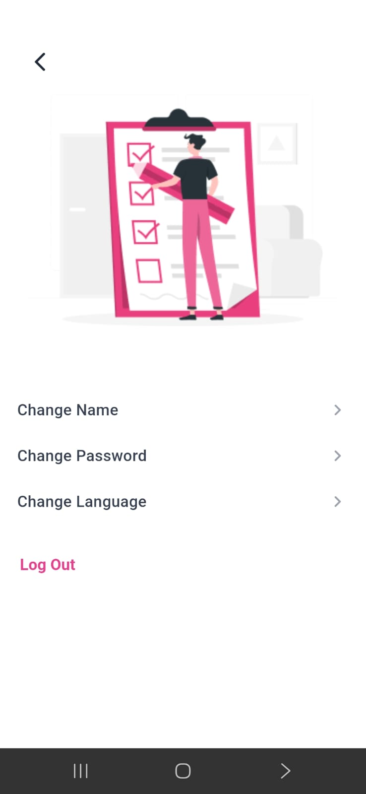
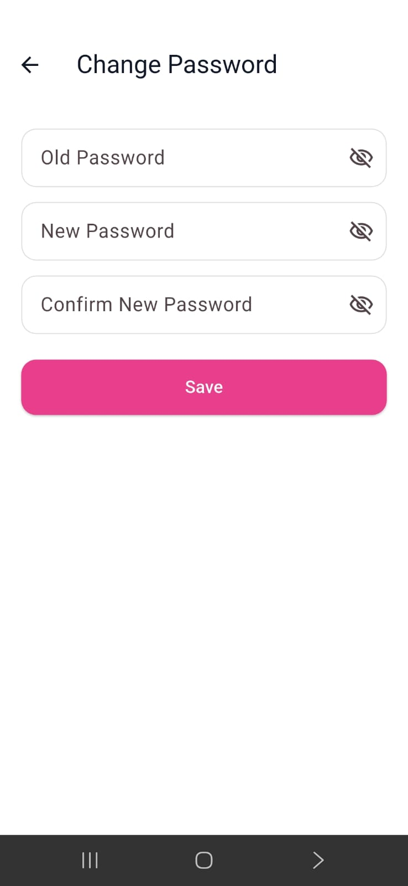

# ✅ ToDo App — Flutter + Firebase


A clean, modern **ToDo** app built with **Flutter** and powered by **Firebase**.  
Includes **Authentication**, **real-time tasks**, **Dark Mode**, and **Localization (Arabic/English)** with a polished UI and smooth UX.

---

## 🎥 Demo
> The video in LinkedIn post here: https://shorturl.at/64kJu

---

## ✨ Features

### 🔐 Authentication (Firebase Auth)
- Sign Up / Sign In
- Forgot Password (Reset via email)
- Logout
- Profile updates:
  - Change Name
  - Change Password

### 📝 Tasks (Cloud Firestore)
- Add task (Bottom Sheet)
- Edit task (same Bottom Sheet in edit mode)
- Delete task
- Real-time updates using Streams
- Tasks stored per user:
  - `users/{uid}/tasks`

### 🌍 Localization
- Supports **Arabic** 🇪🇬 and **English** 🇺🇸
- Instant language switching

### 🌙 Theme
- Light / Dark Mode toggle
- Controlled from the Drawer

### 🎨 UI/UX
- Feature-first clean structure
- Responsive layout (keyboard-safe + small screens friendly)
- Drawer shortcuts (Profile / Theme / Add Task / Logout)

---

## 🧱 Tech Stack
- **Flutter / Dart**
- **Firebase Authentication**
- **Cloud Firestore**
- **Localization** (AR / EN)
- **Streams** for real-time UI updates

---

## 📸 Screenshots

<p align="center">
  
  
  
</p>

<p align="center">
  
  
  
</p>

<p align="center">
  
  
  
</p>

---

## 🚀 Getting Started

### 📦 Prerequisites

Make sure you have installed:

- Flutter SDK (latest stable)
- Dart SDK
- Firebase account
- Firebase CLI
- FlutterFire CLI

Check Flutter installation:

```bash
flutter --version
```

---

### 🔥 Firebase Setup

1️⃣ Create a new project from  
https://console.firebase.google.com/

2️⃣ Enable:
- Authentication → Email/Password
- Cloud Firestore

3️⃣ Install FlutterFire CLI (if not installed):

```bash
dart pub global activate flutterfire_cli
```

4️⃣ Configure Firebase for the project:

```bash
flutterfire configure
```

This will generate:

```
lib/firebase_options.dart
```

---

### 📥 Install Dependencies

```bash
flutter pub get
```

---

### ▶️ Run the App

```bash
flutter run
```

To run on a specific device:

```bash
flutter devices
flutter run -d <device_id>
```

---

### 🏗 Build Release APK

```bash
flutter build apk --release
```

---

### 🍏 Build for iOS (Mac only)

```bash
flutter build ios
```

---


## 🤝 Contributing

Contributions are welcome and appreciated!

If you'd like to improve this project:

1. Fork the repository
2. Create your feature branch:
   ```bash
   git checkout -b feature/your-feature-name
   ```
3. Commit your changes:
   ```bash
   git commit -m "Add your feature"
   ```
4. Push to the branch:
   ```bash
   git push origin feature/your-feature-name
   ```
5. Open a Pull Request

Please make sure:
- Code is clean and readable
- No unnecessary files are included
- The app builds successfully before submitting PR

---

## ⭐ Support

If you found this project helpful:

- ⭐ Star the repository
- 🛠 Suggest improvements
- 🐛 Report issues
- 📢 Share it with others

Your support means a lot!

---

## 🧑‍💻 Author

**Mohamed Hatem**

- 🎓 Faculty of Computers & AI Graduate
- 💙 Flutter Developer
- 🔥 Passionate about Mobile Development